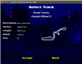
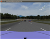

# 智能驾驶数据集

## 数据集总体介绍

智能驾驶数据集包含：

- 车辆检测数据集

- 深度强化学习TORCS数据集

- 交通标志检测数据集

- 车道线检测数据集

- TORCS端到端数据集

- Carla数据集


对于深度强化学习算法而言，有一套完备的数据集对于算法开发十分重要，目前我们已经采集并整理了深度强化学习TORCS数据集、车道线检测数据集、车辆检测数据集、交通标志数据集，其中深度强化学习TORCS数据集包含12W条TORCS环境下的训练数据，可以用来训练深度强化学习算法，大小约20G；端到端学习TORCS数据集124G，可以训练端到端模型和Dagger强化学习横向控制模型；以及在城市交通环境仿真器Carla数据9G；车道线检测数据集包括自主采集数据(14G)、中国智能车未来挑战赛数据和图森等公布的车道线检测数据约79G，车辆检测数据集约3G，交通标志数据集约85G。

数据集详情如下表：

<table>
  <tr>
    <th>数据集类型</th>
    <th>数据集名称</th>
    <th>大小</th>
    <th>地点</th>
    <th>时间</th>
    <th>视频段个数</th>
    <th>说明</th>
  </tr>
  <tr>
    <td rowspan="11">车道线检测数据</td>
    <td rowspan="3">Tusimple 数据集</td>
    <td rowspan="3">58G </td>
    <td rowspan="3">美国<br>San Diego<br>(高速路场景)</td>
    <td>2017年3月</td>
    <td>2858</td>
    <td>57160张图片</td>
  </tr>
  <tr>
    <td>2017年5月</td>
    <td>2321</td>
    <td>46420张图片</td>
  </tr>
  <tr>
    <td>2017年6月</td>
    <td>1229</td>
    <td>24580张图片</td>
  </tr>
  <tr>
    <td rowspan="2">CULane 数据集</td>
    <td rowspan="2">66.3G</td>
    <td rowspan="2">北京<br>(城市环境)</td>
    <td>2017年5月</td>
    <td>489</td>
    <td>85018张图片</td>
  </tr>
  <tr>
    <td>2017年6月</td>
    <td>782</td>
    <td>48217张图片</td>
  </tr>
  <tr>
    <td>中国智能车未来挑战赛数据</td>
    <td>10.9G</td>
    <td>江苏<br>(城市和高速环境)</td>
    <td>2017年</td>
    <td>60</td>
    <td>7268张图片</td>
  </tr>
  <tr>
    <td rowspan="5">自主采集数据集<br>(未标注)</td>
    <td rowspan="5">14GB</td>
    <td>北京安立路</td>
    <td>2017年9月</td>
    <td></td>
    <td>1945张图片(812M)</td>
  </tr>
  <tr>
    <td>北京奥体中路</td>
    <td>2017年9月</td>
    <td></td>
    <td>2523张图片(992M)</td>
  </tr>
  <tr>
    <td>北京知春路</td>
    <td>2017年9月</td>
    <td></td>
    <td>13101张图片(5.02GB)</td>
  </tr>
  <tr>
    <td>北京奥体中心附近路段</td>
    <td>2017年9月</td>
    <td></td>
    <td>15841张图片(6.06GB)</td>
  </tr>
  <tr>
    <td>北京致真大厦地下车库</td>
    <td>2017年9月</td>
    <td></td>
    <td>3268张图片(1.28GB)</td>
  </tr>
  <tr>
    <td rowspan="3">深度强化学习数据</td>
    <td>深度强化学习TORCS数据集</td>
    <td>20G</td>
    <td>TORCS仿真环境</td>
    <td>2017年</td>
    <td></td>
    <td>12W张图片</td>
  </tr>
  <tr>
    <td>端到端学习TORCS数据集</td>
    <td>124G<br>(数据说明见下文)</td>
    <td>TORCS仿真环境</td>
    <td>2018年</td>
    <td></td>
    <td>30个.h5文件</td>
  </tr>
  <tr>
    <td>Carla城市环境数据集</td>
    <td>9G</td>
    <td>Carla仿真环境</td>
    <td>2019年</td>
    <td></td>
    <td>Carla仿真环境文件</td>
  </tr>
  <tr>
    <td>车辆检测数据集</td>
    <td>2016和2017年<br>中国智能车未来挑战赛<br>离线测试数据集-<br>车辆检测数据集</td>
    <td>3G</td>
    <td>江苏</td>
    <td>2016年<br>2017年</td>
    <td></td>
    <td></td>
  </tr>
  <tr>
    <td rowspan="3">交通标志数据</td>
    <td>2016和2017年<br>中国智能车未来挑战赛<br>离线测试数据集-<br>车辆检测数据集</td>
    <td>6G</td>
    <td>江苏，陕西</td>
    <td>2016年<br>2017年</td>
    <td></td>
    <td>3174张图片</td>
  </tr>
  <tr>
    <td>TT100K清华大学-腾讯交通标志数据集</td>
    <td>71.3G</td>
    <td>全国</td>
    <td>2016年</td>
    <td></td>
    <td>100000张图片</td>
  </tr>
  <tr>
    <td>CCTSDB长沙理工交通标志数据集</td>
    <td>8.5G</td>
    <td>长沙</td>
    <td>2017年</td>
    <td></td>
    <td>10000张图片</td>
  </tr>
</table>

[点击这里](https://share.weiyun.com/5x6mSpt)获取数据集。

## 端到端学习TORCS数据集说明

该数据集一共30个.h5文件，大小123.1GB。

### 数据标签格式

```
\host_data
	\frame_0
		image: driver-view RGB image (res. 640x480) /图像大小
		pos_x: X coordinate in global frame /X坐标
		pos_y: Y coordinate in global frame /Y坐标
		vel_x: velocity along vehicle heading direction /x方向速度
		vel_y: velocity opposite to vehicle heading direction /y方向速度
		dist_to_center: distance to track center /到轨道中心距离
		dist_raced: distance has raced /行驶路程
		yaw: angle difference between vehicel heading and track orientation/偏航角
		steer: steering angle normalized by steering ratio (21 degree)/转角
		accel: normalized acceleration/加速度
		brake: normalized brake/制动
	\frame_1
	...
```

数据文件命名格式：赛道名-车道数-使用的bot名，数据集包含6种驾驶场景：三车道结构化道路，三车道非结构化道路，双车道结构化道路，双车道非结构化道路，单车道结构化道路和单车道非结构化道路。示例图片如下：


 
Chenyi-wheel2-6m-8_lane3_dc123
车道名：Chenyi-wheel2-6m-8，车道数：3，使用的bot：host_bot、dc1_bot、dc2_bot、dc3_bot。
